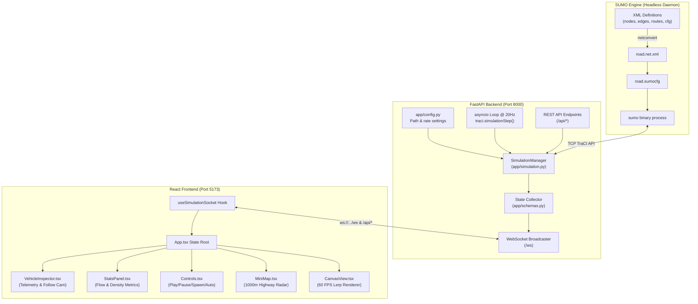

# AGENTS.md: Traffis Codebase Guide & Architecture Map

Welcome to **Traffis**. This document serves as the primary system map, architectural blueprint, and development guide for AI agents (and human engineers) working on this codebase.

---

## 1. Project Overview & Mission

**Traffis** is a real-time microscopic traffic simulation and visualization platform. It connects a high-fidelity traffic physics engine with a reactive web-based interface:
- **Simulation Engine**: [Eclipse SUMO (Simulation of Urban MObility)](https://eclipse.dev/sumo/) running in headless daemon mode.
- **Backend Application**: [Python 3.12+ FastAPI](file:///Users/vijay/Projects/traffis/backend/app/main.py) communicating with SUMO via [TraCI (Traffic Control Interface)](file:///Users/vijay/Projects/traffis/backend/app/simulation.py) over a TCP socket.
- **Data Streaming**: Full-duplex WebSocket broadcasting vehicle kinematics and network metrics at **20 Hz (50ms ticks)**.
- **Frontend Dashboard**: [React 19 + TypeScript 5.9 + Vite](file:///Users/vijay/Projects/traffis/frontend) rendering a high-performance **HTML5 Canvas viewport (60 FPS interpolated)**, interactive radar mini-map, telemetry HUD, and simulation controls.

---

## 2. High-Level Architecture & Data Flow



---

## 3. Directory & File Structure Map

```text
/Users/vijay/Projects/traffis/
├── AGENTS.md                     # [This file] Primary guide for AI agents & engineers
├── README.md                     # Human-facing introduction & setup documentation
├── start.sh                      # Shell script: compiles network & starts backend + frontend
├── backend/                      # Python FastAPI + SUMO TraCI service
│   ├── .venv/                    # Python virtual environment
│   ├── requirements.txt          # Python dependencies (fastapi, uvicorn, traci, etc.)
│   ├── run.py                    # Backend server entry point (pre-build check + uvicorn)
│   ├── test_ws.py                # Standalone E2E verification test for WebSockets & TraCI
│   ├── app/                      # Application package
│   │   ├── __init__.py           # Package marker
│   │   ├── config.py             # Settings, SUMO_HOME resolver, tick rates, highway specs
│   │   ├── schemas.py            # Pydantic schemas (VehicleData, Stats, StateMessage, SpawnRequest)
│   │   ├── simulation.py         # SimulationManager class: TraCI controller & 20Hz async loop
│   │   └── main.py               # FastAPI app, lifespan setup, REST endpoints & WebSocket route
│   └── sumo_config/              # SUMO road geometry and routes
│       ├── build_network.py      # Python script to compile .nod.xml & .edg.xml into .net.xml
│       ├── road.nod.xml          # Node/junction definitions (start at 0.0, end at 1000.0)
│       ├── road.edg.xml          # Edge definition (3-lane road, 120 km/h speed limit)
│       ├── road.net.xml          # Compiled SUMO binary road network (generated)
│       ├── road.rou.xml          # Vehicle type definitions (car, truck, sports, van) & route
│       └── road.sumocfg          # Master SUMO configuration file
└── frontend/                     # React + TypeScript + Vite web application
    ├── index.html                # HTML entry point, fonts & metadata
    ├── package.json              # Frontend dependencies (React 19, Lucide, Vite 8, etc.)
    ├── vite.config.ts            # Vite config with reverse-proxy (/api and /ws -> 8000)
    ├── tsconfig.json             # Root TypeScript config
    ├── tsconfig.app.json         # Browser TypeScript compilation rules
    ├── tsconfig.node.json        # Node/Vite tooling TypeScript configuration
    ├── .oxlintrc.json            # Oxlint static analysis rules
    └── src/
        ├── main.tsx              # React DOM initialization
        ├── App.tsx               # Root component, state coordination & hotkeys
        ├── App.css               # App-level styling
        ├── index.css             # Design tokens, CSS variables, glassmorphism & resets
        ├── types/
        │   ├── simulation.ts     # TypeScript interfaces matching backend Pydantic models
        │   └── auth.ts           # User profile & authentication schema contracts
        ├── hooks/
        │   ├── useSimulationSocket.ts # WebSocket connection, reconnection, rate/jitter tracker
        │   └── useAuth.ts        # Persistent Google authentication state & session manager
        ├── components/
        │   ├── LandingPage.tsx   # Main landing page with 4 screenshot cards, hero banner & CTA
        │   ├── GoogleSignInModal.tsx # Google OAuth modal dialog with one-click profile picker
        │   ├── AboutModal.tsx    # About popup with system specs, architecture & contact email
        │   ├── ImageLightboxModal.tsx # Fullscreen screenshot inspector with technical specs
        │   ├── Header.tsx        # Top status bar, connection health, audio toggle, reset & profile
        │   ├── CanvasView.tsx    # HTML5 Canvas viewport: camera pan/zoom/follow, traffic gantry & 60fps lerp
        │   ├── MiniMap.tsx       # 1000m radar bar, vehicle dots, traffic signal marker, viewport bounding box
        │   ├── Controls.tsx      # Transport controls, vehicle spawner, vehicle inflow rate slider, signal quick pill
        │   ├── StatsPanel.tsx    # Telemetry metrics (active count, speed, lane distribution)
        │   ├── VehicleInspector.tsx # Floating inspector card for individual vehicle telemetry
        │   └── TrafficSignalPanel.tsx # Interactive Traffic Signal HUD: timings sliders, phase countdown, manual overrides
        └── utils/
            └── audio.ts          # Web Audio API procedural sound synthesizer (tones for spawns, resets & signal changes)
```

---

## 4. Key Components & Responsibilities

### 4.1 Backend ([`backend/`](file:///Users/vijay/Projects/traffis/backend))

| Module | Primary Responsibility | Critical Methods / Classes |
| :--- | :--- | :--- |
| [`app/config.py`](file:///Users/vijay/Projects/traffis/backend/app/config.py) | Configuration management and path auto-detection. Discovers `SUMO_HOME` and `sumo` binaries on macOS (Framework / Homebrew) and Linux. | `resolve_sumo_home()`, `resolve_sumo_binary()`, `Settings` class (`settings` singleton). |
| [`app/schemas.py`](file:///Users/vijay/Projects/traffis/backend/app/schemas.py) | Data exchange contracts validated via Pydantic v2. | `VehicleData`, `SimulationStats`, `SimulationStateMessage`, `SpawnRequest`, `AutoSpawnConfig`, `NetworkInfo`. |
| [`app/simulation.py`](file:///Users/vijay/Projects/traffis/backend/app/simulation.py) | **Core orchestrator**. Owns TraCI process lifecycle, runs the 20 Hz simulation background task, manages auto-spawning, coordinates thread locks, and extracts vehicle kinematics. | `SimulationManager`, `start()`, `stop()`, `reset()`, `play()`, `pause()`, `step_once()`, `spawn_vehicle()`, `_simulation_loop()`, `_collect_current_state()`. |
| [`app/main.py`](file:///Users/vijay/Projects/traffis/backend/app/main.py) | FastAPI application with ASGI lifespan handler. Exposes REST endpoints for simulation control and bidirectional WebSocket at `/ws`. | `lifespan(app)`, `websocket_endpoint()`, `/api/health`, `/api/network-info`, `/api/spawn`, etc. |
| [`sumo_config/build_network.py`](file:///Users/vijay/Projects/traffis/backend/sumo_config/build_network.py) | Generates SUMO XML files (`.nod.xml`, `.edg.xml`, `.rou.xml`, `.sumocfg`) and executes `netconvert` to compile [`road.net.xml`](file:///Users/vijay/Projects/traffis/backend/sumo_config/road.net.xml). | `build()`, `find_sumo_binary()`. |
| [`run.py`](file:///Users/vijay/Projects/traffis/backend/run.py) | CLI entrypoint. Verifies network compilation before starting `uvicorn`. | Direct execution: `python run.py`. |
| [`test_ws.py`](file:///Users/vijay/Projects/traffis/backend/test_ws.py) | Integration test script connecting to `ws://127.0.0.1:8000/ws`, tests state reception, spawning, pausing, and resetting. | Direct execution: `python test_ws.py`. |

### 4.2 Frontend ([`frontend/`](file:///Users/vijay/Projects/traffis/frontend))

| Component / File | Primary Responsibility |
| :--- | :--- |
| [`src/types/simulation.ts`](file:///Users/vijay/Projects/traffis/frontend/src/types/simulation.ts) | TypeScript type definitions mirroring backend schemas (`Vehicle`, `SimulationStats`, `CameraState`, `SpawnOptions`, etc.). |
| [`src/hooks/useSimulationSocket.ts`](file:///Users/vijay/Projects/traffis/frontend/src/hooks/useSimulationSocket.ts) | Manages WebSocket lifecycle, auto-reconnect backoff (1.5s), message dispatch, packet rate (Hz) calculation, and REST fallbacks. |
| [`src/App.tsx`](file:///Users/vijay/Projects/traffis/frontend/src/App.tsx) | Root application state: camera coordinates, selected vehicle ID, audio preferences, keyboard listeners (`Space` = toggle, `R` = reset, `S` = spawn). |
| [`src/components/CanvasView.tsx`](file:///Users/vijay/Projects/traffis/frontend/src/components/CanvasView.tsx) | HTML5 Canvas renderer with `requestAnimationFrame` loop. Computes world-to-screen transforms, interpolates vehicle positions between 20Hz ticks, renders road markings, vehicles, wheels, headlights, brake glow, and leader indicators. |
| [`src/components/MiniMap.tsx`](file:///Users/vijay/Projects/traffis/frontend/src/components/MiniMap.tsx) | 1000m overview radar bar. Shows road lines, glowing vehicle dots color-coded to actual cars, and camera viewport bounding box. Supports click/drag to jump camera position. |
| [`src/components/Controls.tsx`](file:///Users/vijay/Projects/traffis/frontend/src/components/Controls.tsx) | Bottom toolbar for Play/Pause, Step, Reset, custom Vehicle Spawner modal (lane, speed, vehicle type, color), and Auto-Spawn rate slider. |
| [`src/components/StatsPanel.tsx`](file:///Users/vijay/Projects/traffis/frontend/src/components/StatsPanel.tsx) | Real-time analytics bar: Active Vehicles, Average Speed (km/h), Traffic Density (veh/km), Total Departed/Arrived, and Lane Utilization bars. |
| [`src/components/VehicleInspector.tsx`](file:///Users/vijay/Projects/traffis/frontend/src/components/VehicleInspector.tsx) | Floating HUD displayed when clicking a vehicle. Displays speed, acceleration/braking state, distance to leader vehicle, lane index, and camera "Follow" toggle. |
| [`src/components/Header.tsx`](file:///Users/vijay/Projects/traffis/frontend/src/components/Header.tsx) | Top navbar with live WebSocket status badge (Connected/Connecting), tick rate indicator (~20 Hz), round-trip jitter, audio toggle, and documentation link. |
| [`src/utils/audio.ts`](file:///Users/vijay/Projects/traffis/frontend/src/utils/audio.ts) | Pure Web Audio API synthesizers producing audio tones for spawn events, simulation reset, and UI clicks without external audio files. |

---

## 5. Domain Concepts, Coordinate Systems & Physics

### 5.1 Highway Geometry
- **Length**: Exactly **1000.0 meters** ($X \in [0.0, 1000.0]$).
- **Lanes**: 4 lanes total (2 lanes in each direction separated by a center median, driving on left side):
  - **Eastbound Carriageway** ($Y \in [0.0, +6.4\text{m}]$, travel West $\to$ East on left side of road, heading $90^\circ$):
    - `EB Lane 0` (Left / Kerbside Slow Lane): Center $Y = +4.8\text{m}$.
    - `EB Lane 1` (Right / Median Fast Overtaking Lane): Center $Y = +1.6\text{m}$.
  - **Center Median**: Centerline divider at $Y = 0.0\text{m}$ (double solid yellow lines).
  - **Westbound Carriageway** ($Y \in [-6.4\text{m}, 0.0]$, travel East $\to$ West on left side of road, heading $270^\circ$):
    - `WB Lane 1` (Right / Median Fast Overtaking Lane): Center $Y = -1.6\text{m}$.
    - `WB Lane 0` (Left / Kerbside Slow Lane): Center $Y = -4.8\text{m}$.
  - Lane width is **3.2 meters** each. Total carriageway width is **12.8 meters** ($Y \in [-6.4, +6.4]$).
- **Traffic Signal**: Junction at $X = 500.0\text{m}$ (`traffic_light` node) dividing the highway with dual stop lines ($X = 497.5\text{m}$ on Eastbound $+Y$ carriageway, $X = 502.5\text{m}$ on Westbound $-Y$ carriageway) and an overhead signal gantry.
- **Speed Limit**: Default $33.33\text{ m/s}$ ($120\text{ km/h}$).

### 5.2 Vehicle Types & Parameters
Defined in [`backend/sumo_config/road.rou.xml`](file:///Users/vijay/Projects/traffis/backend/sumo_config/road.rou.xml):
- `car`: Standard passenger car ($L = 5.0\text{m}$, $W = 1.8\text{m}$, Max Speed $33.33\text{ m/s}$, Accel $2.6\text{ m/s}^2$, Decel $4.5\text{ m/s}^2$).
- `sports`: Fast sports sedan ($L = 4.6\text{m}$, $W = 1.9\text{m}$, Max Speed $45.0\text{ m/s}$, Accel $4.2\text{ m/s}^2$, Decel $6.0\text{ m/s}^2$).
- `truck`: Heavy transport ($L = 10.0\text{m}$, $W = 2.4\text{m}$, Max Speed $25.0\text{ m/s}$, Accel $1.3\text{ m/s}^2$, Decel $3.5\text{ m/s}^2$).
- `van`: Light commercial delivery ($L = 5.5\text{m}$, $W = 2.0\text{m}$, Max Speed $30.0\text{ m/s}$, Accel $2.2\text{ m/s}^2$, Decel $4.2\text{ m/s}^2$).

### 5.3 Units & Conversions
- **SUMO / TraCI Internal**: Meters ($\text{m}$), seconds ($\text{s}$), meters per second ($\text{m/s}$), meters per second squared ($\text{m/s}^2$).
- **UI Display**: Speed in kilometers per hour ($\text{km/h} = \text{speed}_{\text{m/s}} \times 3.6$).
- **Canvas World-to-Screen Mapping**:
  $$\text{screenX} = (\text{worldX} - \text{camera.x}) \times \text{camera.zoom} + \frac{\text{canvasWidth}}{2}$$
  $$\text{screenY} = (\text{worldY} - \text{camera.y}) \times \text{camera.zoom} + \frac{\text{canvasHeight}}{2}$$

---

## 6. Communication Protocols & APIs

### 6.1 WebSocket Protocol (`/ws`)

#### Server to Client Messages
1. **Network Info** (sent on initial connection):
   ```json
   {
     "type": "network_info",
     "data": {
       "road_length": 1000.0,
       "num_lanes": 3,
       "lane_width": 3.2,
       "traffic_light_x": 500.0,
       "lanes": [...]
     }
   }
   ```
2. **State Broadcast** (broadcasted at 10 Hz with SUMO physics running at 20 Hz):
   ```json
   {
     "type": "state",
     "sim_time": 14.25,
     "step": 285,
     "is_running": true,
     "scenario_id": "straight_road",
     "compact_vehicles": [
       ["veh_1", 245.8, -1.6, 13.9, 0.1, 90.0, 1, "car", "#38bdf8", 5.0, 1.8, "veh_0", 42.1, "east"]
     ],
     "stats": {
       "active_vehicles": 8,
       "total_spawned": 12,
       "total_arrived": 4,
       "avg_speed_kmh": 49.9,
       "density_veh_km": 8.0,
       "pce_per_hour": 1500.0
     },
     "traffic_light": {
       "id": "traffic_light",
       "x": 500.0,
       "state": "green",
       "raw_state": "GGGG",
       "mode": "auto",
       "green_duration": 15.0,
       "yellow_duration": 3.0,
       "red_duration": 12.0,
       "phase_timer": 3.5,
       "phase_remaining": 11.5,
       "next_state": "yellow"
     },
     "default_speed_kmh": 50.0,
     "max_sim_time": 300.0,
     "time_limit_reached": false
   }
   ```
3. **Acknowledgments**:
   - `{"type": "spawn_ack", "vehicle_id": "veh_9"}`
   - `{"type": "auto_spawn_ack", "auto_spawn": {"enabled": true, "rate_per_minute": 45.0, "rate_per_hour": 2700.0}}`
   - `{"type": "traffic_light_ack", "traffic_light": {...}}`
   - `{"type": "default_speed_ack", "default_speed_kmh": 50.0}`

#### Client to Server Commands
Sent as JSON text over the WebSocket:
- `{"action": "play"}`
- `{"action": "pause"}`
- `{"action": "step"}`
- `{"action": "reset"}`
- `{"action": "spawn", "payload": {"lane": 1, "speed": 13.9, "type": "sports", "color": "#f43f5e"}}`
- `{"action": "set_auto_spawn", "payload": {"enabled": true, "rate_per_minute": 45.0}}`
- `{"action": "set_default_speed", "payload": {"speed_kmh": 50.0}}`
- `{"action": "set_traffic_light", "payload": {"green_duration": 20.0, "yellow_duration": 4.0, "red_duration": 15.0, "mode": "auto"}}`
- `{"action": "next_traffic_light_phase"}`

### 6.2 REST Endpoints

| Method | Endpoint | Description |
| :--- | :--- | :--- |
| `GET` | `/api/health` | Backend status, active client count, SUMO init status. |
| `GET` | `/api/network-info` | Road dimensions, traffic light position, and lane specifications. |
| `POST` | `/api/play` | Resume simulation loop. |
| `POST` | `/api/pause` | Pause simulation loop. |
| `POST` | `/api/step` | Advance simulation by one step ($0.05\text{s}$). |
| `POST` | `/api/reset` | Close and restart SUMO, reset clock to $0.0\text{s}$. |
| `POST` | `/api/spawn` | Insert vehicle (`SpawnRequest` body). Returns vehicle ID. |
| `POST` | `/api/auto-spawn` | Configure inflow rate spawner (`AutoSpawnConfig` body). |
| `POST` | `/api/default-speed` | Configure default vehicle cruising speed limit (`{"speed_kmh": 50}`). |
| `POST` | `/api/traffic-light` | Configure signal timings and mode (`TrafficLightConfig` body). |
| `POST` | `/api/traffic-light/next`| Advance traffic signal to the next phase immediately. |

---

## 7. Concurrency, Locking & Performance Patterns

### 7.1 TraCI Thread-Safety
- **Constraint**: TraCI communicates with SUMO via a synchronous TCP socket. Multiple concurrent calls to `traci.*` will corrupt the socket stream.
- **Pattern**: [`SimulationManager`](file:///Users/vijay/Projects/traffis/backend/app/simulation.py) wraps every TraCI interaction inside `async with self.lock:`.
- **Broadcast Isolation**: The state dictionary is serialized and broadcast to WebSockets *outside* the critical lock section to avoid blocking simulation steps during network I/O.

### 7.2 Decoupled Physics & Rendering (20Hz Physics -> 10Hz Network -> 60FPS Display)
- **High-Fidelity Physics @ 20 Hz**: SUMO executes numerical integration steps at 20 Hz ($0.05\text{s}$) to preserve Krauss car-following, gap acceptance, and detector accuracy.
- **Network Bandwidth Reduction @ 10 Hz**: The backend broadcasts state updates at 10 Hz (every 2nd step) using compact positional tuples (`compact_vehicles`), reducing bandwidth by **~88%** (from 300 MB down to ~35 MB in a 3-minute high-density run).
- **Smooth 60 FPS Viewport**: [`CanvasView.tsx`](file:///Users/vijay/Projects/traffis/frontend/src/components/CanvasView.tsx) interpolates vehicle coordinates via `requestAnimationFrame` lerp:
  $$\text{currentX} \mathrel{+}= (\text{targetX} - \text{currentX}) \times \min(1.0, \text{dt} \times 15)$$
  $$\text{currentY} \mathrel{+}= (\text{targetY} - \text{currentY}) \times \min(1.0, \text{dt} \times 15)$$
  This produces silky-smooth 60 FPS motion without jitter or visual hitching.

---

## 8. Development, Run & Test Workflows

### 8.1 Environment Variables
Before running the backend, ensure `SUMO_HOME` is set:
```bash
# macOS (Framework):
export SUMO_HOME="/Library/Frameworks/EclipseSUMO.framework/Versions/Current/EclipseSUMO/share/sumo"
export PATH="/Library/Frameworks/EclipseSUMO.framework/Versions/Current/EclipseSUMO/bin:$PATH"

# macOS (Homebrew):
# export SUMO_HOME="$(brew --prefix sumo)/share/sumo"
# export PATH="$(brew --prefix sumo)/bin:$PATH"
```

### 8.2 One-Command Startup
```bash
cd /Users/vijay/Projects/traffis
./start.sh
```
This compiles the road network if missing, starts the FastAPI backend at `http://127.0.0.1:8000`, and launches Vite at `http://localhost:5173`.

### 8.3 Starting Backend Individually
```bash
cd /Users/vijay/Projects/traffis/backend
./.venv/bin/python run.py
```

### 8.4 Starting Frontend Individually
```bash
cd /Users/vijay/Projects/traffis/frontend
npm run dev
```

### 8.5 Automated Testing & Verification
```bash
# 1. Run WebSocket + TraCI End-to-End Test (requires backend running)
cd /Users/vijay/Projects/traffis/backend
./.venv/bin/python test_ws.py

# 2. Lint Frontend with Oxlint
cd /Users/vijay/Projects/traffis/frontend
npm run lint

# 3. Typecheck & Build Frontend
cd /Users/vijay/Projects/traffis/frontend
npm run build
```

---

## 9. Common Recipes for AI Agents Extending Traffis

### Recipe 1: Adding a New Vehicle Type
1. Edit [`backend/sumo_config/road.rou.xml`](file:///Users/vijay/Projects/traffis/backend/sumo_config/road.rou.xml) (and update [`backend/sumo_config/build_network.py`](file:///Users/vijay/Projects/traffis/backend/sumo_config/build_network.py)):
   ```xml
   <vType id="motorcycle" accel="5.0" decel="7.0" sigma="0.2" length="2.4" width="0.9" minGap="1.5" maxSpeed="40.0" guiShape="motorcycle"/>
   ```
2. Update allowed types in [`backend/app/schemas.py`](file:///Users/vijay/Projects/traffis/backend/app/schemas.py) and [`backend/app/simulation.py`](file:///Users/vijay/Projects/traffis/backend/app/simulation.py) (`_insert_vehicle`).
3. Update frontend type definitions in [`frontend/src/types/simulation.ts`](file:///Users/vijay/Projects/traffis/frontend/src/types/simulation.ts) and vehicle options in [`frontend/src/components/Controls.tsx`](file:///Users/vijay/Projects/traffis/frontend/src/components/Controls.tsx).
4. In [`frontend/src/components/CanvasView.tsx`](file:///Users/vijay/Projects/traffis/frontend/src/components/CanvasView.tsx), add a specialized rendering branch for the new vehicle dimensions and styling.

### Recipe 2: Adding a Static Obstacle / Road Closure
1. In [`backend/app/simulation.py`](file:///Users/vijay/Projects/traffis/backend/app/simulation.py), use TraCI's vehicle stop or lane speed methods:
   ```python
   # Stop a vehicle permanently or close a lane segment:
   traci.lane.setMaxSpeed("road_0", 0.0) # closes slow lane
   ```
2. Broadcast the hazard/closure coordinates in `SimulationStateMessage`.
3. In [`frontend/src/components/CanvasView.tsx`](file:///Users/vijay/Projects/traffis/frontend/src/components/CanvasView.tsx), render safety cones, hazard stripes, or barrier icons at the blocked coordinates.

### Recipe 3: Modifying Road Geometry (e.g. Adding Lanes or Curves)
1. Modify [`backend/sumo_config/road.edg.xml`](file:///Users/vijay/Projects/traffis/backend/sumo_config/road.edg.xml) or [`backend/sumo_config/build_network.py`](file:///Users/vijay/Projects/traffis/backend/sumo_config/build_network.py).
2. Run `python backend/sumo_config/build_network.py` to regenerate [`road.net.xml`](file:///Users/vijay/Projects/traffis/backend/sumo_config/road.net.xml).
3. Update `NUM_LANES` and lane mapping in [`backend/app/config.py`](file:///Users/vijay/Projects/traffis/backend/app/config.py) and [`backend/app/simulation.py`](file:///Users/vijay/Projects/traffis/backend/app/simulation.py) (`get_network_info`).
4. Update [`frontend/src/components/CanvasView.tsx`](file:///Users/vijay/Projects/traffis/frontend/src/components/CanvasView.tsx) and [`frontend/src/components/MiniMap.tsx`](file:///Users/vijay/Projects/traffis/frontend/src/components/MiniMap.tsx) to match the new lane count and boundary offsets.

### Recipe 4: Adding a New Road / Simulation Scenario (e.g. 4-Way Crossroads, Roundabout)
1. **Network XML Definition**:
   In [`backend/sumo_config/build_network.py`](file:///Users/vijay/Projects/traffis/backend/sumo_config/build_network.py), add the scenario's nodes (`.nod.xml`), edges (`.edg.xml`), routes (`.rou.xml`), and configuration (`.sumocfg`). Compile the `.net.xml` network into `backend/sumo_config/scenarios/<scenario_id>/`.
2. **Backend Scenario Class**:
   Create a new class in `backend/app/scenarios/<scenario_id>.py` extending [`BaseScenario`](file:///Users/vijay/Projects/traffis/backend/app/scenarios/base.py). Implement `get_metadata()`, `get_network_info()`, `get_spawn_route()`, `get_auto_spawn_request()`, and traffic light handlers.
3. **Register Scenario**:
   In [`backend/app/scenarios/registry.py`](file:///Users/vijay/Projects/traffis/backend/app/scenarios/registry.py), register the new scenario instance in `init_registry()`. It will immediately appear in `GET /api/scenarios` and the frontend Road dropdown.
4. **Frontend Canvas & Radar Support**:
   In [`frontend/src/components/CanvasView.tsx`](file:///Users/vijay/Projects/traffis/frontend/src/components/CanvasView.tsx) and [`frontend/src/components/MiniMap.tsx`](file:///Users/vijay/Projects/traffis/frontend/src/components/MiniMap.tsx), add a renderer function for the scenario's road geometry.

