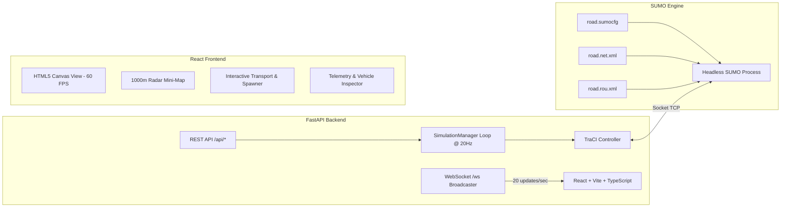

# Traffis: Real-Time SUMO & React Traffic Simulator

A high-performance, full-stack microscopic traffic simulation platform combining **Eclipse SUMO (Simulation of Urban MObility)**, **Python FastAPI with TraCI**, and a modern **React + TypeScript + HTML5 Canvas** frontend.


---

## 🚦 System Architecture



---

## 🛣️ Highway Network Configuration

Located in `backend/sumo_config/`, the network models a **1000-meter straight 3-lane highway**:

- **`road.nod.xml`**: Defines origin node `start` at $(0.0, 0.0)$ and destination node `end` at $(1000.0, 0.0)$.
- **`road.edg.xml`**: Defines a 3-lane straight edge with maximum speed limit of $33.33 \text{ m/s}$ ($120 \text{ km/h}$).
- **`road.net.xml`**: Compiled binary SUMO network generated using `netconvert`:
  - **Lane 0 (Right / Slow)**: Width $3.2\text{m}$, center line $y = -8.0\text{m}$
  - **Lane 1 (Middle)**: Width $3.2\text{m}$, center line $y = -4.8\text{m}$
  - **Lane 2 (Left / Fast)**: Width $3.2\text{m}$, center line $y = -1.6\text{m}$
- **`road.rou.xml`**: Defines vehicle classes (`car`, `sports`, `truck`, `van`) with realistic physics (acceleration, deceleration, minimum gap, length, width).
- **`road.sumocfg`**: Simulation configuration configured for headless operation with step length $0.05\text{s}$ ($20\text{ steps/sec}$).

To recompile the network at any time:
```bash
python backend/sumo_config/build_network.py
```

---

## ⚡ Real-Time Simulation Loop & WebSockets

- Headless SUMO runs via **TraCI** on Python 3.12.
- The background simulation loop executes every **$50\text{ms}$ ($20\text{ Hz}$)**.
- At every tick, vehicle coordinates ($x$, $y$, lane index, speed, acceleration, heading angle, color, leader distance) are streamed over the WebSocket endpoint `/ws` to all connected clients.
- TraCI operations are guarded by an asynchronous lock to ensure thread safety during dynamic vehicle insertion.

---

## 🎮 Frontend Features

1. **HTML5 Canvas Rendering (60+ FPS)**:
   - High-fidelity rendering of the 3-lane road with dashed lane dividers, distance badges every 50m, start gantry at 0m, and finish gantry at 1000m.
   - Smooth interpolation between 20Hz server ticks for buttery-smooth car motion.
   - Dynamic vehicle graphics with headlights, glowing brake taillights, and speed tags.
   - Pan (drag mouse), Zoom (mouse wheel), and preset camera jumps (Start, Mid, Finish, Fit 1000m).
2. **Highway Radar (Mini-Map)**:
   - Full 0m to 1000m overview radar bar showing moving vehicle dots and camera viewport frustum.
   - Click anywhere on the radar to jump the camera.
3. **Vehicle Inspector HUD**:
   - Click any vehicle on the road to inspect its real-time telemetry (speed, acceleration, lane, distance to lead vehicle).
   - "Track with Camera" mode follows the vehicle down the highway.
4. **Simulation Controls**:
   - **Play / Pause**: Toggle simulation (Keyboard shortcut: `Space`).
   - **Reset**: Instantly resets the simulation back to $t=0.0\text{s}$ (Keyboard shortcut: `R`).
   - **Step**: Advance 1 tick ($0.05\text{s}$).
   - **Manual Spawner**: Choose lane (Auto, 0, 1, 2), vehicle type (Sedan, Sports, Truck, Van), color palette, and speed.
   - **Auto Traffic Flow**: Background Poisson-distributed spawner with configurable vehicle rate ($5$ to $60\text{ veh/min}$).

---

## 🚀 Quick Start

### Option 1: One-Click Startup Script

```bash
./start.sh
```

This script verifies the compiled network, launches the FastAPI backend on `http://127.0.0.1:8000`, and starts the Vite React frontend on `http://localhost:5173`.

### Option 2: Manual Startup

#### 1. Backend Setup
```bash
cd backend
# Create virtual environment and install dependencies
/opt/homebrew/bin/uv venv --python 3.12 .venv
source .venv/bin/activate
pip install -r requirements.txt

# Run backend
python run.py
```

#### 2. Frontend Setup
```bash
cd frontend
npm install
npm run dev
```

Open [http://localhost:5173](http://localhost:5173) in your browser.

---

## 📡 API Reference

### WebSocket Endpoint: `ws://127.0.0.1:8000/ws`
Accepts commands:
```json
{ "action": "play" }
{ "action": "pause" }
{ "action": "reset" }
{ "action": "step" }
{ "action": "spawn", "payload": { "lane": 1, "type": "sports", "color": "#f43f5e", "speed": 30.0 } }
{ "action": "set_auto_spawn", "payload": { "enabled": true, "rate_per_minute": 25.0 } }
```

### REST Endpoints
- `GET /api/health`: Health status and simulation time
- `GET /api/network-info`: Geometry and lane metadata for the 1000m road
- `POST /api/play`: Resume simulation
- `POST /api/pause`: Pause simulation
- `POST /api/reset`: Reset simulation
- `POST /api/spawn`: Spawn vehicle dynamically
