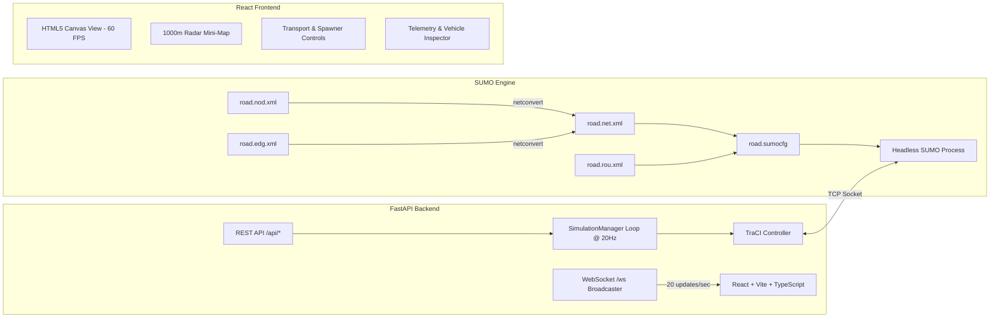

# Traffis: Real-Time SUMO & React Traffic Simulator

A high-performance, full-stack microscopic traffic simulation platform combining **Eclipse SUMO (Simulation of Urban MObility)**, **Python FastAPI with TraCI**, and a modern **React + TypeScript + HTML5 Canvas** frontend.


---

## 🚦 System Architecture



---

## 📋 Prerequisites & Environment Setup

Before running the application, ensure the following are installed:

### 1. Eclipse SUMO (1.20+)
SUMO must be installed with binaries (`sumo`, `netconvert`) and the `SUMO_HOME` directory available:

- **macOS (Official Framework / DMG)**:
  Download and install from the [Eclipse SUMO website](https://eclipse.dev/sumo/).
  The framework installs to:
  ```bash
  /Library/Frameworks/EclipseSUMO.framework/Versions/Current/EclipseSUMO
  ```
- **macOS (Homebrew)**:
  ```bash
  brew tap dlr-ts/sumo
  brew install sumo
  ```
- **Linux (Ubuntu/Debian)**:
  ```bash
  sudo add-apt-repository ppa:sumo/stable
  sudo apt-get update
  sudo apt-get install sumo sumo-tools sumo-doc
  ```

#### Set SUMO Environment Variables
Add to your `~/.zshrc` or `~/.bashrc`:
```bash
# macOS Framework location:
export SUMO_HOME="/Library/Frameworks/EclipseSUMO.framework/Versions/Current/EclipseSUMO/share/sumo"
export PATH="/Library/Frameworks/EclipseSUMO.framework/Versions/Current/EclipseSUMO/bin:$PATH"

# Or for Homebrew:
# export SUMO_HOME="$(brew --prefix sumo)/share/sumo"
# export PATH="$(brew --prefix sumo)/bin:$PATH"
```

Verify the installation:
```bash
sumo --version
netconvert --version
```

### 2. Python 3.12+
Python 3.12 or latest stable Python (managed with `uv`, `venv`, or `conda`).

### 3. Node.js (20+) & npm
```bash
node -v
npm -v
```

---

## 🛣️ SUMO Road Network Configuration

The simulation takes place on a **1000-meter straight 3-lane highway** located in [`backend/sumo_config/`](file:///Users/vijay/Projects/traffis/backend/sumo_config):

| File | Purpose | Key Parameters |
| :--- | :--- | :--- |
| [`road.nod.xml`](file:///Users/vijay/Projects/traffis/backend/sumo_config/road.nod.xml) | Node coordinates | `start` at $(0, 0)$, `traffic_light` at $(500, 0)$, `end` at $(1000, 0)$ |
| [`road.edg.xml`](file:///Users/vijay/Projects/traffis/backend/sumo_config/road.edg.xml) | Edge definition | `road_in` ($0 \to 500\text{m}$), `road_out` ($500 \to 1000\text{m}$), 3 lanes each |
| [`road.rou.xml`](file:///Users/vijay/Projects/traffis/backend/sumo_config/road.rou.xml) | Routes & vehicle types | Route `route_straight` (`road_in road_out`); `car`, `sports`, `truck`, `van` |
| [`road.sumocfg`](file:///Users/vijay/Projects/traffis/backend/sumo_config/road.sumocfg) | SUMO configuration | `step-length="0.05"` ($20\text{ steps/second}$), collision action `none` |
| [`road.net.xml`](file:///Users/vijay/Projects/traffis/backend/sumo_config/road.net.xml) | Compiled SUMO network | Compiled binary road geometry with `traffic_light` logic produced by `netconvert` |

### Lane Geometry Details
- **Lane 0 (Right / Slow)**: Width $3.2\text{m}$, Center line $y = -8.0\text{m}$
- **Lane 1 (Middle)**: Width $3.2\text{m}$, Center line $y = -4.8\text{m}$
- **Lane 2 (Left / Fast)**: Width $3.2\text{m}$, Center line $y = -1.6\text{m}$
- **Traffic Signal**: Junction at $x = 500.0\text{m}$ with stop bar at $x = 497.5\text{m}$ and overhead 3-lane gantry

### Compiling the Road Network
To generate the XML configuration files and compile `road.net.xml` using `netconvert`:
```bash
cd backend
python sumo_config/build_network.py
```
*(The backend also compiles this automatically on startup if `road.net.xml` is missing).*

---

## 🚀 Start Instructions

### Option A: One-Click Startup Script (Recommended)

Run the included [`start.sh`](file:///Users/vijay/Projects/traffis/start.sh) script from the project root:

```bash
./start.sh
```

This script:
1. Configures `SUMO_HOME` and adds SUMO binaries to `PATH`.
2. Validates and compiles the 1000m 3-lane road network with `netconvert`.
3. Activates the Python virtual environment and starts the **FastAPI backend** on `http://127.0.0.1:8000`.
4. Starts the **Vite React frontend** on `http://localhost:5173`.
5. Gracefully handles `Ctrl+C` to terminate both servers and release TraCI ports.

---

### Option B: Manual Step-by-Step Setup

#### Step 1: Set Up Backend

```bash
cd backend

# Create Python virtual environment (e.g., using uv or standard venv)
uv venv --python 3.12 .venv
# Or: python3.12 -m venv .venv

# Activate virtual environment
source .venv/bin/activate

# Install required packages
pip install -r requirements.txt

# (Optional) Verify SUMO TraCI and network compilation
python sumo_config/build_network.py
python test_ws.py
```

#### Step 2: Run Backend Server

```bash
# Ensure SUMO_HOME is exported
export SUMO_HOME="/Library/Frameworks/EclipseSUMO.framework/Versions/Current/EclipseSUMO/share/sumo"
export PATH="/Library/Frameworks/EclipseSUMO.framework/Versions/Current/EclipseSUMO/bin:$PATH"

# Run FastAPI server
python run.py
```
The backend starts on **`http://127.0.0.1:8000`** and opens the WebSocket endpoint on **`ws://127.0.0.1:8000/ws`**.

#### Step 3: Set Up and Run Frontend

In a new terminal window:
```bash
cd frontend

# Install npm dependencies
npm install

# Start Vite dev server
npm run dev
```

Open your browser and navigate to:
👉 **[http://localhost:5173](http://localhost:5173)**

---

## 🎮 Simulation Controls & Features

### Transport & Controls Toolbar
- **Play / Pause** (`Space` key): Start or freeze real-time SUMO physics.
- **Reset** (`R` key): Instantly cleans all active vehicles and resets simulation time to $0.0\text{s}$.
- **Step**: Advance simulation by one step ($0.05\text{s}$).
- **Manual Vehicle Spawner** (`S` key):
  - **Lane Selection**: Choose Lane 0 (Right), Lane 1 (Middle), Lane 2 (Left), or Auto/Random.
  - **Vehicle Type**: `car` (sedan), `sports` (sportscar), `truck` (10m semi-trailer), or `van`.
  - **Color Palette**: Choose vehicle body color with real-time preview.
  - **Speed Slider**: Set initial departure speed ($15\text{ m/s}$ to $45\text{ m/s}$).
- **Auto Traffic Flow**: Background Poisson traffic generator with adjustable volume ($5$ to $60\text{ vehicles/min}$).

### Canvas Viewport & Navigation
- **Pan**: Click and drag anywhere on the highway canvas.
- **Zoom**: Mouse scroll wheel in/out.
- **Camera Presets**: Quick buttons to jump to **Start (0m)**, **Midpoint (500m)**, **Finish (1000m)**, or **Fit 1000m** to view the entire highway.
- **1000m Radar Mini-Map**: Top radar strip displays all moving vehicle dots and camera viewport box. Click anywhere to jump the camera.
- **Vehicle Inspector HUD**: Click on any vehicle to view:
  - Speed ($km/h$ & $m/s$)
  - Longitudinal position ($0\text{m}$ to $1000\text{m}$)
  - Acceleration / Braking state
  - Distance to lead vehicle
  - **Track with Camera** mode: Locks camera to follow the car along the highway.

---

## 📡 API & WebSocket Reference

### WebSocket Protocol: `ws://127.0.0.1:8000/ws`

The server pushes updates at **20 Hz** ($50\text{ms}$ interval):

```json
{
  "type": "state",
  "sim_time": 18.45,
  "step": 369,
  "is_running": true,
  "vehicles": [
    {
      "id": "veh_12",
      "x": 342.5,
      "y": -4.8,
      "lane_index": 1,
      "lane_id": "road_1",
      "speed": 28.4,
      "speed_kmh": 102.2,
      "acceleration": 0.35,
      "angle": 90.0,
      "type": "car",
      "color": "#38bdf8",
      "length": 5.0,
      "width": 1.8,
      "leader_id": "veh_11",
      "leader_dist": 22.4
    }
  ],
  "stats": {
    "active_vehicles": 14,
    "total_spawned": 22,
    "total_arrived": 8,
    "avg_speed_kmh": 98.7,
    "density_veh_km": 14.0
  }
}
```

#### Client Control Commands (Send over WebSocket or REST)
```json
{ "action": "play" }
{ "action": "pause" }
{ "action": "reset" }
{ "action": "step" }
{ "action": "spawn", "payload": { "lane": 1, "type": "sports", "color": "#f43f5e", "speed": 33.3 } }
{ "action": "set_auto_spawn", "payload": { "enabled": true, "rate_per_minute": 25.0 } }
```

### REST Endpoints
- `GET /api/health`: Health status, active clients, and simulation time
- `GET /api/network-info`: 1000m road metadata, lane bounds, and speed limits
- `POST /api/play`: Resume simulation
- `POST /api/pause`: Pause simulation
- `POST /api/reset`: Reset simulation
- `POST /api/spawn`: Insert vehicle dynamically
- `POST /api/auto-spawn`: Configure auto-flow parameters

---

## 🛠️ Verification & Testing

To test the backend and WebSocket communication without opening a browser:
```bash
python backend/test_ws.py
```
This script validates:
- WebSocket connection to `/ws`
- 20 Hz telemetry streaming
- Dynamic vehicle insertion via TraCI
- Pause, Play, and Reset lifecycle transitions

---

## ❓ Troubleshooting

| Issue | Cause | Solution |
| :--- | :--- | :--- |
| `netconvert not found` or `sumo not found` | SUMO binaries not in `PATH` | Ensure `export PATH="/Library/Frameworks/EclipseSUMO.framework/Versions/Current/EclipseSUMO/bin:$PATH"` is executed. |
| `SUMO_HOME not set` warning | `SUMO_HOME` environment variable missing | Set `export SUMO_HOME="/Library/Frameworks/EclipseSUMO.framework/Versions/Current/EclipseSUMO/share/sumo"`. |
| Port 8000 or 5173 already in use | Another server process running | Run `lsof -i :8000` or `lsof -i :5173` and kill existing processes. |
| TraCI connection refused | Headless SUMO failed to boot | Verify network files exist (`python backend/sumo_config/build_network.py`) before starting server. |
